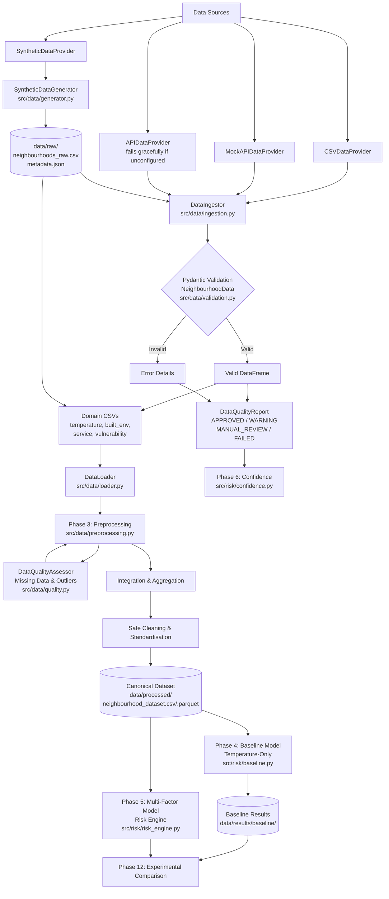

# Data Pipeline Architecture

This document describes the Phase 2 data pipeline architecture for the Neighbourhood Heat-Risk Communication and Outreach Planner.

## Overview

Phase 2 implements the data generation, ingestion, validation, and quality reporting layers. All downstream phases (3–13) consume the outputs produced here.

## Data Flow Diagram

## Provider Architecture

The ingestion layer uses an abstract `BaseDataProvider` pattern so that data sources can be swapped without changing the validation or downstream pipeline.

| Provider | Phase 2 Status | Purpose |
|---|---|---|
| `SyntheticDataProvider` | ✅ Implemented | Default: generates 40 synthetic Chennai neighbourhoods |
| `CSVDataProvider` | ✅ Implemented | Reads any schema-compatible CSV file |
| `MockAPIDataProvider` | ✅ Implemented | Drop-in mock for temperature / built-environment / service-access APIs |
| `APIDataProvider` | 🔄 Placeholder | Real external API (OpenWeatherMap, government met APIs) — future phases |

## Data Contracts

### Raw Layer (`data/raw/`)
- `neighbourhoods_raw.csv` — original generator output, never overwritten
- `metadata.json` — provenance: dataset_name, version, seed, generated_at, record_count

### Processed Layer (`data/processed/`)
- `neighbourhood_dataset.csv` — schema-validated records ready for Phase 3 preprocessing

### Schema (`src/data/validation.py`)
`NeighbourhoodData` enforces 31 typed fields across six categories:
- **Identity**: neighbourhood_id, name, district, lat/lon
- **Temperature**: observation_date, temperature_c (0–60°C), heat_index, humidity (0–100%)
- **Built Environment**: built_density, green_cover_percent (0–100%), impervious_surface_percent (0–100%), urban_heat_exposure_score
- **Service Access**: healthcare_distance_km (≥0), healthcare_capacity (≥0), transport_access_score, estimated_people_reachable, travel_time_minutes (≥0), service_time_minutes (≥0)
- **Vulnerability / Population**: vulnerability_index, elderly_population_percent, low_income_indicator, total_population, mobile_population (≤ total), mobile_population_percent
- **Fairness Groups**: group_mobile, group_low_service_access
- **Metadata**: data_source, generated_at, dataset_version, synthetic_data

## Failure Simulation Flags

Controlled via `src/config/settings.py` (or `.env` overrides):

| Flag | Effect |
|---|---|
| `SIMULATE_MISSING_TEMPERATURE=true` | Injects NaN into temperature_c |
| `SIMULATE_INVALID_COORDINATES=true` | Sets latitude=100.0 on first record |
| `SIMULATE_DUPLICATE_NEIGHBOURHOOD=true` | Repeats NH-000 as record index 2 |
| `SIMULATE_EXTREME_TEMPERATURE=true` | Sets base_temp=55°C on second record |

## Connection to Downstream Phases

| Phase | Consumes from Phase 2 |
|---|---|
| Phase 3 (Preprocessing) | `data/processed/neighbourhood_dataset.csv` |
| Phase 4 (Baseline Model) | `temperature_c` |
| Phase 5 (Risk Engine) | All built-environment + vulnerability fields |
| Phase 6 (Confidence) | `DataQualityReport` (missing_values, out_of_range_values, status) |
| Phase 7 (Optimisation) | `travel_time_minutes`, `service_time_minutes`, `healthcare_capacity`, `estimated_people_reachable` |
| Phase 8 (Fairness) | `group_mobile`, `group_low_service_access`, `total_population`, `mobile_population` |
| Phase 9 (Communication) | `neighbourhood_name`, temperature and vulnerability fields |
| Phase 10 (Override) | `neighbourhood_id` (stable identifier for all decisions) |
| Phase 12 (Experiment) | `data/raw/metadata.json` (seed, version for reproducibility) |
